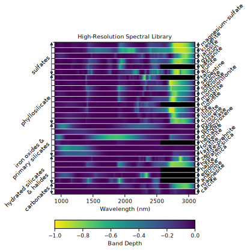
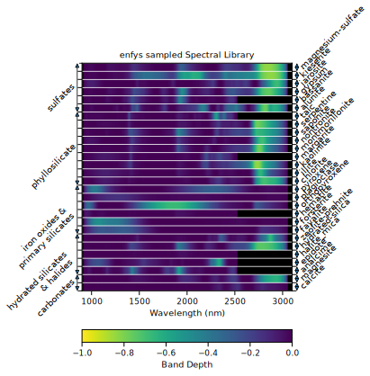

# Simulating the Spectral Sampling of the Enfys IR Spectrometer

<p align="center">
  <a href="" rel="noopener">
 </a>
</p>

## Table of Contents

- [Simulating the Spectral Sampling of the Enfys IR Spectrometer](#simulating-the-spectral-sampling-of-the-enfys-ir-spectrometer)
  - [Table of Contents](#table-of-contents)
  - [About ](#about-)
  - [Setup ](#setup-)
  - [Authors ](#authors-)
  - [Acknowledgements ](#acknowledgements-)

## About <a name = "about"></a>

This notebook logs simulations of the Enfys IR spectrometer for the ExoMars Rosalind Franklin Rover using the Spectral Parameters Toolkit (SPTK).

Two key outputs of this notebook are visualisations of the sampling of Enfys in the form of a spectrograph, that can compared to the high-resolution input spectra from the MICA files used here.

A. High-Resolution Input Spectra |B. Enfys Sampled Spectra
--|--
</a>|</a>

## Setup <a name = "setup"></a>

For this development I am using a local copy of the sptk repository, and I have installed this via conda in development mode. The dependency, including the local path to the sptk repository, is included in the environment.yml file of this repository.

To recreate this, clone a copy of the sptk/cassis_development branch, and then copy the path of this local repository copy and replace the corresponding line of the environment.yml file:

Replace this with the location of your local cloned copy of the ```cassis_sptk`` branch:
```
  - pip:
    - -e /Users/a-rogs/Documents/software/sptk 
```

To run this notebook, create an environment from the [```environment.yml```](./environment.yml) file:

```
conda env create -f environment.yml
```

Once the dependencies, including the local copy of **sptk** have completed installing, activate the environment with:

```
conda activate enfys_sptk
```

## Authors <a name = "authors"></a>

This notebook was designed and developed by [@rbstabbins](https://github.com/rbstabbins).

See also the list of [contributors](https://github.com/rbstabbins/sptk/contributors) who participated in this project.

## Acknowledgements <a name = "acknowledgements"></a>

Please see the dataset repository ([doi:10.5281/zenodo.10684347](https://zenodo.org/doi/10.5281/zenodo.10684347)) for acknowledgements and citation of the source datasets used in this study.

This project has been funded by the following grant:
- UK Space Agency Mars Exploration Science Standard Call 2023: Exploring the Limits of Material Discrimination with CaSSIS Multiband Imaging ST/Y005910/1